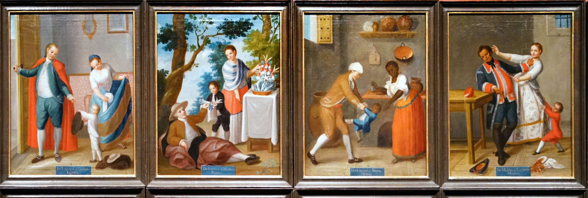

---
[Syllabus](index.html) · [Grades & Assignments](assignments.html) · [Policies](policies.html) · [Schedule](Schedule.html) · [Questions for Consideration](QforCs.html) · [Print All](print.html)

---
# History 141 – Colonial Latin America

### Fall 2026
### Professor Frank “Trey” Proctor III

Class:  8:30-9:50 TTH Fellows 207  
Office Hours:  TTH 1000-1130,  and by appointment   
Office: 404 Fellows Hall  
Email: [proctorf@denison.edu](mailto:proctorf@denison.edu)  
Preferred pronouns: he/him/his

## Course Goals:    
The course is designed to introduce students to the histories and problems of colonial Latin America.  However, the course is designed in a largely thematic, rather than chronological, order.

Upon completion of this course you should have a general understanding of: 1\) how Spain and Portugal conquered and colonized the Americas, 2\) how they managed to maintain control over those colonies for as long as they did; 2\) why that control faltered when it did leading to Independence movements; and, 4\) how the colonized \- women, Indians, Africans, *castas* (mixed-raced peoples)*,* and Creoles \- responded to, and resisted or accommodated the imposition of colonial rule. 

**Objectives:**  The primary objectives of this course are for us to strengthen our critical, historical, and empathetic thinking skills; to articulate complex and compelling arguments based on available evidence; and, to hone our ability to express those arguments and ideas in written and oral form.

**Power and Justice: This course fulfills the Power and Justice General Education Requirement.**  As such, we will pay special attention to the nature of power in the colonial setting and how colonial power relations both informed, and were informed by, other systems of power such as race, religion, class, and sex/gender.

History can feel very voyeuristic, in that it allows us to peer into the personal lives of our subjects and see what they thought and how they lived their lives. History as a discipline provides an exciting opportunity to explore how people understand and understood power and difference, because of that ability to peek into people’s private lives to see how they themselves experienced power relations based on such issues as sex, gender, race, ethnicity, class, and/or religion. 

History is best understood as a conversation between a series of diverse arguments and not the simple rote memorization of names, places, and dates that are so often associated with the discipline.  Therefore, the course is designed such that  

1) That you become better able to articulate and analyze the various historical forces which have shaped and will continue to shape the trajectory of Latin American history.  
2) That you come to understand the varied experiences of the people who inhabited Latin America over time *and* the various factors (such as race, ethnicity, class, and/or gender) that might explain potential differences in their experiences.  
3) That you hone your skills at interpreting historical sources and the historical literature, learning to identify and critique the various explicit and implicit arguments within such sources.  
4) That you hone your skills at articulating complex and yet answerable questions.  
5) That you sharpen your skills at expressing your informed conclusions about any topic in written and oral form.

> **In theory, these learning objectives fall into the following basic categories:**
> - **Questioning and Argumentation** — History is asking good questions and about making arguments
> - **Information Literacy** — History is about not taking sources at face value, but interrogating the questions of "what?" and "why?"
> - **Empathetic Thinking** — History allows us to explore how systems of power around issues of race, ethnicity, class, and gender developed in colonial Spanish and Portuguese-speaking America AND how individuals and groups of people lived through those realities.
> - **Communication** — History requires that we hone our abilities to express our knowledge and learning in various forms. We will practice that.

## Office Hours: 
The purpose of office hours is to make myself available to my students to discuss our class, their assignments, and perhaps even their larger Denison experience.  I am here and ready to help/talk/listen.

I would strongly encourage you to take advantage of office hours, or to set up an appointment.  I can promise that doing so will help you be your most effective and successful in my course.

---
[Syllabus](index.html) · [Grades & Assignments](assignments.html) · [Policies](policies.html) · [Schedule](Schedule.html) · [Questions for Consideration](QforCs.html) · [Print All](print.html)
